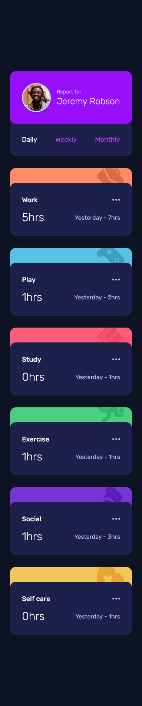
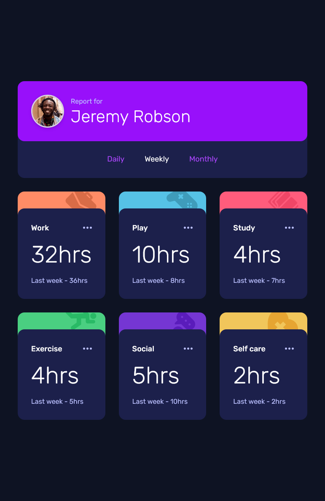
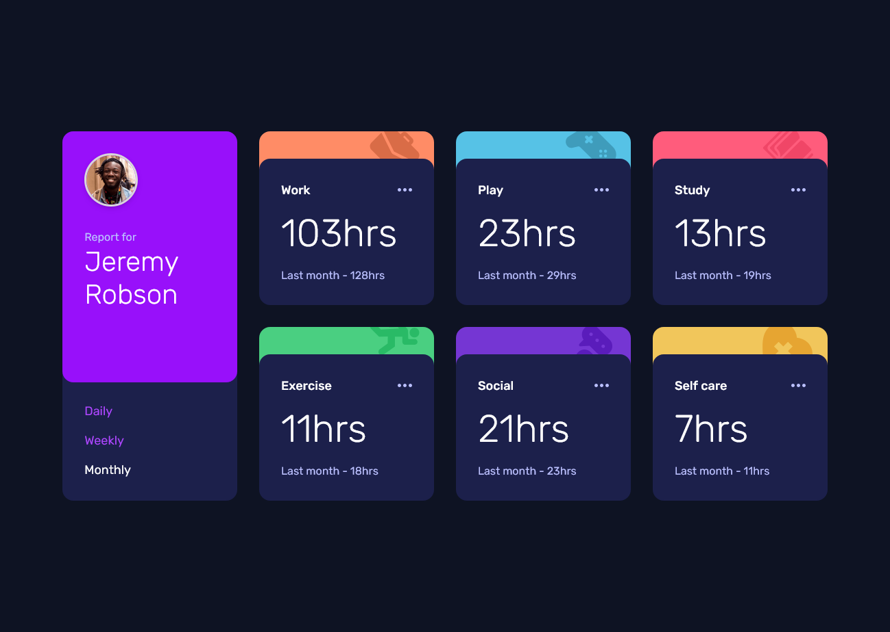

# Frontend Mentor - Time tracking dashboard solution

This is a solution to the [Time tracking dashboard challenge on Frontend Mentor](https://www.frontendmentor.io/challenges/time-tracking-dashboard-UIQ7167Jw). Frontend Mentor challenges help you improve your coding skills by building realistic projects. 

## Table of contents

- [Overview](#overview)
  - [The challenge](#the-challenge)
  - [Screenshot](#screenshot)
  - [Links](#links)
- [My process](#my-process)
  - [Built with](#built-with)
  - [What I learned](#what-i-learned)
  - [Useful resources](#useful-resources)

## Overview

### The challenge

Users should be able to:

- View the optimal layout for the site depending on their device's screen size
- See hover states for all interactive elements on the page
- Switch between viewing Daily, Weekly, and Monthly stats

### Screenshot


Here is a screenshot of the mobile solution:



--

Here is a screenshot of the tablet solution with the active button:



--

Here is a screenshot of the desktop solution:




### Links

- Solution URL: [Frontend Mentor](https://www.frontendmentor.io/solutions/newsletter-sign-up-form-with-success-message-h6sUgA4fLI)
- Live Site URL: [Vercel.com](https://newsletter-sign-up-form-mocha.vercel.app/)


## My process

### Built with

- Semantic HTML5 markup
- CSS (Tailwind)
- Flexbox
- CSS Grid
- Mobile-first workflow
- JavaScript
- Json

### What I learned

Working on this project helped me practice several important concepts:

- **Fetching and manipulating JSON data**  
  I learned how to use `fetch()` to load a local `data.json` file and then iterate over the array of objects.  
  Example:  
  ```js
  fetch("data.json")
    .then(res => res.json())
    .then(data => {
      data.forEach(item => {
        console.log(item.title, item.timeframes.daily.current);
      });
    });

- Accessing nested objects in JSON, I understood the difference between arrays (data[0]) and objects (data[0].timeframes.daily.current), and when to use `Object.keys()` to loop through dynamic keys.

- Dynamic UI updates based on user interaction, by clicking on buttons like Daily, Weekly, or Monthly, I learned how to change the displayed values and use a mapping object to display different label (Yesterday, Last week, Last month).

- Mapping JSON values to external resources, I figured out how to handle keys with spaces (like "Self Care") by normalizing strings (`replace(/\s+/g, "-")`) or by using a dictionary to map titles to icons or colors.

### Useful resources

- [ChatGPT (OpenAI)](https://chatgpt.com/) - This helped me understand how different CSS properties work together, especially layout behavior and default styles. I used it as a coding assistant whenever I had a doubt.
- [Tailwind CSS Documentation](https://tailwindcss.com/) - The official documentation was a great resource for me while working on this project. I really liked how well-structured it is, with clear examples for each utility class. It helped me understand how to quickly apply styles and manage responsive design using Tailwind.
- [W3Schools](https://www.w3schools.com) - I used this site a lot to review syntax, explore new CSS properties, and test small snippets of code. It's really helpful for quick references and hands-on practice while learning.
- [MDN Web Docs](https://developer.mozilla.org/) - I used this documentation frequently to understand JavaScript methods, DOM events, and browser APIs. It’s an excellent resource for clear explanations and reliable references.
